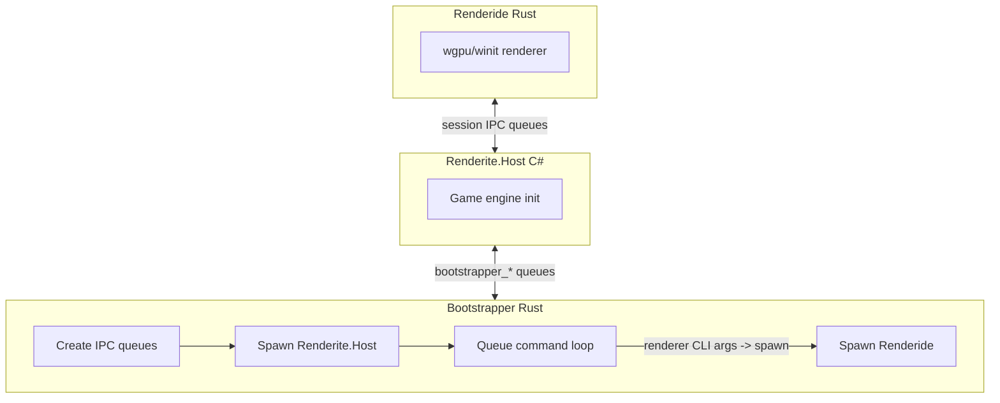

# Renderide

A Rust renderer for Resonite, replacing the Unity renderer with a custom Unity-like one using wgpu.

## Warning

There are a lot of performance, support, and stability issues with the renderer currently. It is not intended for consumer use at the moment and comes with many rendering features enabled for testing purposes. There may be other visual bugs or unexpected behavior.

## Overview

Resonite (formerly Neos VR) is a FrooxEngine-based VR and social platform. Renderite is its renderer abstraction layer (Host, Shared, Unity). Renderide acts as a drop-in renderer replacement, cross-platform with a focus on Linux via native dotnet host.



The queue loop keeps running after spawn; the host typically sends renderer CLI arguments (e.g. `-QueueName …`) as its first message. On the wire, only `HEARTBEAT`, `SHUTDOWN`, `GETTEXT`, and `SETTEXT…` are special-cased; any other line is parsed as spawn arguments (the Rust code calls this `StartRenderer`).

## Architecture

Bootstrapper creates IPC queues, spawns Renderite.Host, and runs the queue loop. When a message is not one of the fixed control strings, the bootstrapper spawns Renderide with those tokens as argv. Host <-> bootstrapper use `{prefix}.bootstrapper_in` / `{prefix}.bootstrapper_out`; host <-> Renderide use separate shared-memory queues named in the renderer args.

| Crate | Path | Purpose |
|-------|------|---------|
| **interprocess** | `crates/interprocess/` | Shared-memory queues (Publisher/Subscriber), circular buffers. Used by bootstrapper and renderide for IPC. |
| **logger** | `crates/logger/` | Shared logging helpers used by bootstrapper and renderide (files, levels, panic hook). |
| **bootstrapper** | `crates/bootstrapper/` | Orchestrator: creates `bootstrapper_in`/`bootstrapper_out` queues, spawns Renderite.Host from Resonite install, runs queue loop (`HEARTBEAT`, `SHUTDOWN`, `GETTEXT`, `SETTEXT…`, plus renderer spawn args as above). Supports Wine on Linux. |
| **renderide** | `crates/renderide/` | Main renderer: wgpu, winit, session/IPC receiver, shared types + packing, scene graph, assets, GPU meshes. Includes **`shaders`** (`src/shaders/`) — UnityShaderConverter output: one folder per shader (`<stem>/mod.rs`, `material.rs`, `passN.wgsl`). Binaries: `renderide`, `roundtrip`. |

## Third-party folders

These are **git submodules** under [`third_party/`](third_party/):

| Folder | Role |
|--------|------|
| **UnityShaderParser** | [`third_party/UnityShaderParser/`](third_party/UnityShaderParser/) — Parses Unity ShaderLab and embedded HLSL. **UnityShaderConverter** references this project to read `.shader` files. |
| **Resonite.UnityShaders** | [`third_party/Resonite.UnityShaders/`](third_party/Resonite.UnityShaders/) — Upstream Resonite public shaders (e.g. under `Assets/Shaders/`). Included in the converter’s **default** scan roots alongside `generators/UnityShaderConverter/SampleShaders/`. |

Initialize or update submodules from the repo root when cloning:

```bash
git submodule update --init --recursive
```

## SharedTypeGenerator

**Location:** `generators/SharedTypeGenerator/` (C# .NET 10)

Converts `Renderite.Shared.dll` into `crates/renderide/src/shared/shared.rs`. Pipeline: TypeAnalyzer (Mono.Cecil) -> PackMethodParser (IL -> SerializationStep) -> RustTypeMapper -> RustEmitter + PackEmitter. Outputs Rust types (POD structs, packable structs, polymorphic entities, enums) with `MemoryPackable` impls matching the C# wire format.

```bash
dotnet run --project generators/SharedTypeGenerator -- -i /path/to/Renderite.Shared.dll [-o output.rs]
```

Default output: `crates/renderide/src/shared/shared.rs`

## UnityShaderConverter

**Location:** `generators/UnityShaderConverter/` (C# .NET 10)

**Generated layout:** Default output root is **`crates/renderide/src/shaders/`**. For each converted Unity shader (snake_case module name) the tool writes a subdirectory (for example **`converter_minimal_unlit/`**) containing **`mod.rs`** (`pub mod material;`), **`material.rs`** (`Material`, **`VariantKey`**, `PASSn_WGSL` via `include_str!("passn.wgsl")`, `wgpu::PipelineCompilationOptions` helpers when specialization axes exist, and stub `create_render_pipeline_passn_stub`), and **one `passN.wgsl` per pass** next to `material.rs` (merged vert+frag from `slangc`). Eligible **`#pragma multi_compile` / `shader_feature`** keywords can map to Slang **`[vk::constant_id(n)]`** bools (WGSL **`override`**) when **`enableSlangSpecialization`** is true in **`DefaultCompilerConfig.json`**; if a pass fails to compile with those constants, the runner may fall back without specialization and emit an empty **`VariantKey`** for that shader so Rust matches the on-disk WGSL. **SharedTypeGenerator** is a different pipeline (Cecil/IL → `shared.rs`) and does not share generator code.

Walks Unity `ShaderLab` sources, parses them with **UnityShaderParser** (see [Third-party folders](#third-party-folders) above), builds **transient** `.slang` in the system temp directory (with `generators/UnityShaderConverter/runtime_slang/UnityCompat.slang` on the include path), runs **`slangc`** once per pass when eligible, writes **`passN.wgsl`** into the shader folder, then deletes the temp Slang inputs (success or failure). A legacy **`shaders/generated/`** tree is removed on run if present.

### Install Slang

**You need the [Slang](https://shader-slang.com/) toolchain installed** if you want the converter to generate or refresh **WGSL** via `slangc`. Without it, you can still run the tool with **`--skip-slang`**: a shader is emitted only when **every** pass already has a non-empty **`passN.wgsl`** next to `material.rs` under `crates/renderide/src/shaders/<mod>/`.

After installing Slang:

- Put **`slangc`** on your **`PATH`**, or  
- Set the **`SLANGC`** environment variable to the full path of the `slangc` executable, or  
- Pass **`--slangc /path/to/slangc`** on the command line.

**`DefaultCompilerConfig.json`** (next to the built executable, or overridden with **`--compiler-config`**) includes **`**/*.shader`** by default, and **`maxVariantCombinationsPerShader`** defaults to **512** (Cartesian product of parsed `#pragma multi_compile` / `shader_feature` groups). Several Unity “macro” pragmas (`multi_compile_fwdbase`, fog, instancing, …) are still **ignored** to avoid combinatorial explosion until those paths are modeled. For quick iteration, narrow **`--input`** or **`slangEligibleGlobPatterns`**. Full-tree runs stay slow and noisy.

### Prerequisites

- [.NET 10 SDK](https://dotnet.microsoft.com/download)
- **Slang** — required for WGSL generation (see above); optional if you use `--skip-slang` and keep committed WGSL

### How to use the shader converter

Always run commands from the **`Renderide/`** directory (or pass absolute paths for `--input` / `--output`).

1. **Regenerate everything except calling `slangc`** (fast; keeps existing WGSL on disk):

   ```bash
   cd Renderide
   dotnet run --project generators/UnityShaderConverter -- --skip-slang
   ```

2. **Run `slangc` for eligible shaders** (needs Slang installed; uses `PATH` / `SLANGC` / `--slangc`):

   ```bash
   cd Renderide
   dotnet run --project generators/UnityShaderConverter --
   ```

3. **Limit what is scanned** — repeatable **`--input <dir>`** (only those roots; omit to use defaults: `generators/UnityShaderConverter/SampleShaders` and `third_party/Resonite.UnityShaders/Assets/Shaders`).

4. **Change output location** — **`--output <dir>`** (default: `crates/renderide/src/shaders`).

5. **Compiler / variant JSON** — **`--compiler-config`** merges over built-in defaults (slang eligibility glob patterns, `maxVariantCombinationsPerShader`, `enableSlangSpecialization`, `maxSpecializationConstants`). **`--variant-config`** supplies per-shader define lists instead of expanding `#pragma multi_compile` automatically.

6. **Rust emission rule** — a shader folder is written only when **every** pass has a non-empty **`passN.wgsl`**. If `slangc` fails or is skipped, fix WGSL or adjust eligibility. Duplicate Unity shader names from different files are skipped after the first (warning). **Hand-written `shaders/mod.rs`** should `pub mod <stem>;` for each converted shader. FrooxEngine material → `Material` / `VariantKey` dispatch stays in the renderer.

7. **wgpu** — match **`PipelineCompilationOptions`** / shader constants to the `wgpu` version in this crate when wiring real pipelines.

**Verbose logs:** add **`-v`** / **`--verbose`**.

**Tests:** `dotnet test generators/UnityShaderConverter.Tests/`

## Tests

**generators/SharedTypeGenerator.Tests/** — xUnit C# tests. Cross-language round-trip: C# packs a random instance -> bytes A; Rust `roundtrip` binary unpacks and packs -> bytes B; assert A == B.

**Prerequisite:** `Renderite.Shared.dll` in `generators/SharedTypeGenerator.Tests/lib/` or set `RENDERITE_SHARED_DLL`.

```bash
cargo build --bin roundtrip
dotnet test generators/SharedTypeGenerator.Tests/
dotnet test generators/UnityShaderConverter.Tests/
cargo test -p renderide minimal_unlit_sample_wgsl_parses
```

## Logging

`Bootstrapper.log` and `HostOutput.log` are written under `logs/` relative to the bootstrapper’s current working directory. At startup the bootstrapper also truncates `logs/Renderide.log` under that same directory. The renderer appends to `logs/Renderide.log` at the workspace root (compile-time path derived from `crates/renderide`). If you run the bootstrapper from the repo root, those `Renderide.log` paths are the same file; if the CWD is elsewhere, you may get two different `Renderide.log` locations.

**Verbosity:** Bootstrapper logging defaults to `trace`. Renderide defaults to `info` when no `-LogLevel` is passed. Pass `--log-level <level>` or `-l <level>` to the bootstrapper to set both bootstrapper and Renderide max levels; the bootstrapper then adds `-LogLevel` to the renderer argv. Levels: `error`, `warn`, `info`, `debug`, `trace`.

```bash
cargo run --bin bootstrapper -- --log-level debug
```

| Log | Path | Created By |
|-----|------|------------|
| Bootstrapper.log | `logs/Bootstrapper.log` | Bootstrapper crate — orchestration, queue commands, errors |
| HostOutput.log | `logs/HostOutput.log` | Bootstrapper (redirects C# host stdout/stderr with [Host stdout]/[Host stderr] prefixes) |
| Renderide.log | `logs/Renderide.log` | Renderide crate — renderer diagnostics (path: repo root via CARGO_MANIFEST_DIR) |

## GPU validation (debugging)

wgpu can enable backend validation (on Vulkan, the validation layers when installed). This is off by default so performance stays high.

- **Enable:** set `RENDERIDE_GPU_VALIDATION=1` (or `true` / `yes`) before starting the renderer so `RenderConfig::gpu_validation_layers` is true at first GPU init (see `crates/renderide/src/config.rs`). Validation is chosen when the wgpu instance is created and cannot be toggled later without restarting the process.
- **Override:** wgpu’s `WGPU_VALIDATION` is still applied via [`InstanceFlags::with_env`](https://docs.rs/wgpu/latest/wgpu/struct.InstanceFlags.html#method.with_env) after that config: any value other than `0` forces validation on; `0` forces it off.

Expect a large performance hit when validation is on; use it only while tracking API errors.

## Building and Running

**Rust:**

```bash
cargo build --release && ./target/release/bootstrapper
```

**Generator (optional):**

```bash
dotnet run --project generators/SharedTypeGenerator -- -i /path/to/Renderite.Shared.dll
```

**Resonite discovery:** `RESONITE_DIR` or Steam (`~/.steam/steam/steamapps/common/Resonite`, `~/.local/share/Steam`, libraryfolders.vdf).

**Bootstrapper:** The renderer binary is resolved next to the bootstrapper executable (`target/release` when using `cargo run`). On Linux the process is started as `Renderite.Renderer`; the bootstrapper can create a symlink to the `renderide` binary there if missing. On Windows it uses `renderide.exe`.

**Wine:** Bootstrapper detects Wine and uses `LinuxBootstrap.sh` in the Resonite directory.

**Renderer configuration:** You can tune Renderide by editing **`configuration.ini`**. The renderer searches for that file next to its executable and in the current working directory (details in `crates/renderide/src/config.rs`). If it is missing, defaults are used. The repository includes a root [`configuration.ini`](configuration.ini) you can copy or adapt; keys and sections are not documented here because they may change—see that file and the config loader for the current layout.

## Goals

- AAA-quality renderer (path tracing, RTAO, RT reflections, PBR, etc.)
- Cross-platform (Linux native via dotnet host)
- Type-safe IPC via generated shared types
- Performance and correctness (skinned meshes, proper shaders, textures)
