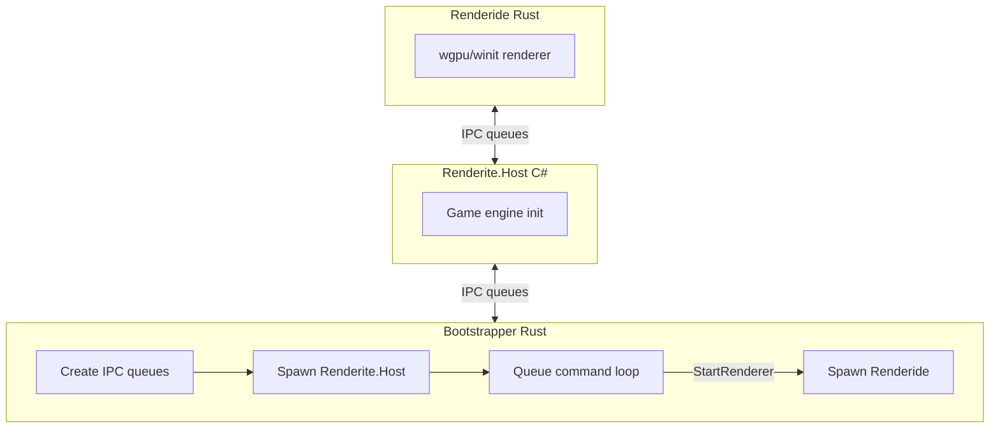

# Renderide

A Rust renderer for Resonite, replacing the Unity-based default with wgpu/winit. Early-stage project with AAA renderer ambitions.

## Warning

There are a lot of performance, support, and stability issues with the renderer currently. It is not intended for consumer use at the moment and comes with many rendering features enabled for testing purposes.

## Overview

Resonite (formerly Neos VR) is a FrooxEngine-based VR and social platform. Renderite is its renderer abstraction layer (Host, Shared, Unity). Renderide acts as a drop-in renderer replacement, cross-platform with a focus on Linux via native dotnet host.



## Architecture

Bootstrapper creates IPC queues, spawns Renderite.Host, runs the queue loop, and spawns Renderide when the Host sends StartRenderer. Host and Renderide communicate via shared-memory queues.

| Crate | Path | Purpose |
|-------|------|---------|
| **interprocess** | `crates/interprocess/` | Shared-memory queues (Publisher/Subscriber), circular buffers. Used by bootstrapper and renderide for IPC. |
| **bootstrapper** | `crates/bootstrapper/` | Orchestrator: creates `bootstrapper_in`/`bootstrapper_out` queues, spawns Renderite.Host from Resonite install, runs queue loop (HEARTBEAT, SHUTDOWN, GETTEXT, SETTEXT, StartRenderer), spawns Renderide when Host requests it. Supports Wine on Linux. |
| **renderide** | `crates/renderide/` | Main renderer: wgpu, winit, session/IPC receiver, shared types + packing, scene graph, assets, GPU meshes. Binaries: `renderide`, `roundtrip`. |

## SharedTypeGenerator

**Location:** `SharedTypeGenerator/` (C# .NET 10)

Converts `Renderite.Shared.dll` into `crates/renderide/src/shared/shared.rs`. Pipeline: TypeAnalyzer (Mono.Cecil) → PackMethodParser (IL → SerializationStep) → RustTypeMapper → RustEmitter + PackEmitter. Outputs Rust types (POD structs, packable structs, polymorphic entities, enums) with `MemoryPackable` impls matching the C# wire format.

```bash
dotnet run --project SharedTypeGenerator -- -i /path/to/Renderite.Shared.dll [-o output.rs]
```

Default output: `crates/renderide/src/shared/shared.rs`

## Tests

**SharedTypeGenerator.Tests/** — xUnit C# tests. Cross-language round-trip: C# packs a random instance → bytes A; Rust `roundtrip` binary unpacks and packs → bytes B; assert A == B.

**Prerequisite:** `Renderite.Shared.dll` in `SharedTypeGenerator.Tests/lib/` or set `RENDERITE_SHARED_DLL`.

```bash
cargo build --bin roundtrip
dotnet test SharedTypeGenerator.Tests/
```

## Logging

All logs under `logs/` (relative to bootstrapper CWD or repo root). Truncated at each run.

**Renderide verbosity:** Pass `--log-level <level>` or `-l <level>` to the bootstrapper to control `logs/Renderide.log` verbosity. Levels: `error`, `warn`, `info`, `debug`, `trace` (default). The bootstrapper forwards this to Renderide when spawning.

```bash
cargo run --bin bootstrapper -- --log-level debug
```

| Log | Path | Created By |
|-----|------|------------|
| Bootstrapper.log | `logs/Bootstrapper.log` | Bootstrapper crate — orchestration, queue commands, errors |
| HostOutput.log | `logs/HostOutput.log` | Bootstrapper (redirects C# host stdout/stderr with [Host stdout]/[Host stderr] prefixes) |
| Renderide.log | `logs/Renderide.log` | Renderide crate — renderer diagnostics (path: repo root via CARGO_MANIFEST_DIR) |

## Building and Running

**Rust:**

```bash
cargo build && cargo run --bin bootstrapper
```

**Generator (optional):**

```bash
dotnet run --project SharedTypeGenerator -- -i /path/to/Renderite.Shared.dll
```

**Resonite discovery:** `RESONITE_DIR` or Steam (`~/.steam/steam/steamapps/common/Resonite`, `~/.local/share/Steam`, libraryfolders.vdf).

**Bootstrapper:** Run from repo root; expects `target/debug/renderide` (or `Renderite.Renderer` symlink on Linux).

**Wine:** Bootstrapper detects Wine and uses `LinuxBootstrap.sh` in the Resonite directory.

## Goals

- AAA-quality renderer (path tracing, RTAO, RT reflections, PBR, etc.)
- Cross-platform (Linux native via dotnet host)
- Type-safe IPC via generated shared types
- Performance and correctness (skinned meshes, proper shaders, textures)
