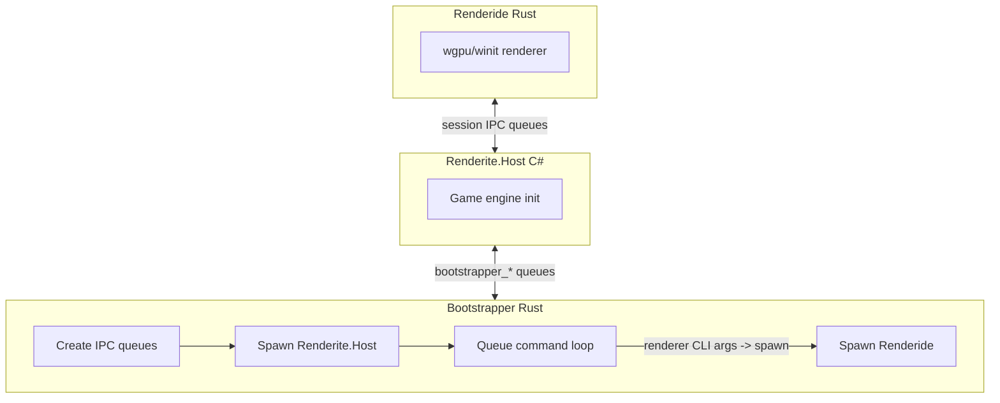

# Renderide

A Rust renderer for Resonite, replacing the Unity renderer with a custom Unity-like one using wgpu.

## Warning

There are a lot of performance, support, and stability issues with the renderer currently. It is not intended for consumer use at the moment and comes with many rendering features enabled for testing purposes. There may be other visual bugs or unexpected behavior.

## Overview

Resonite (formerly Neos VR) is a FrooxEngine-based VR and social platform. Renderite is its renderer abstraction layer (Host, Shared, Unity). Renderide acts as a drop-in renderer replacement, cross-platform with a focus on Linux via native dotnet host.



The queue loop keeps running after spawn; the host typically sends renderer CLI arguments (e.g. `-QueueName …`) as its first message. On the wire, only `HEARTBEAT`, `SHUTDOWN`, `GETTEXT`, and `SETTEXT…` are special-cased; any other line is parsed as spawn arguments (the Rust code calls this `StartRenderer`).

## Architecture

Bootstrapper creates IPC queues, spawns Renderite.Host, and runs the queue loop. When a message is not one of the fixed control strings, the bootstrapper spawns Renderide with those tokens as argv. Host <-> bootstrapper use `{prefix}.bootstrapper_in` / `{prefix}.bootstrapper_out`; host <-> Renderide use separate shared-memory queues named in the renderer args.

| Crate | Path | Purpose |
|-------|------|---------|
| **interprocess** | `crates/interprocess/` | Shared-memory queues (Publisher/Subscriber), circular buffers. Used by bootstrapper and renderide for IPC. |
| **logger** | `crates/logger/` | Shared logging helpers used by bootstrapper and renderide (files, levels, panic hook). |
| **bootstrapper** | `crates/bootstrapper/` | Orchestrator: creates `bootstrapper_in`/`bootstrapper_out` queues, spawns Renderite.Host from Resonite install, runs queue loop (`HEARTBEAT`, `SHUTDOWN`, `GETTEXT`, `SETTEXT…`, plus renderer spawn args as above). Supports Wine on Linux. |
| **renderide** | `crates/renderide/` | Main renderer: wgpu, winit, session/IPC receiver, shared types + packing, scene graph, assets, GPU meshes. Binaries: `renderide`, `roundtrip`. |

## SharedTypeGenerator

**Location:** `SharedTypeGenerator/` (C# .NET 10)

Converts `Renderite.Shared.dll` into `crates/renderide/src/shared/shared.rs`. Pipeline: TypeAnalyzer (Mono.Cecil) -> PackMethodParser (IL -> SerializationStep) -> RustTypeMapper -> RustEmitter + PackEmitter. Outputs Rust types (POD structs, packable structs, polymorphic entities, enums) with `MemoryPackable` impls matching the C# wire format.

```bash
dotnet run --project SharedTypeGenerator -- -i /path/to/Renderite.Shared.dll [-o output.rs]
```

Default output: `crates/renderide/src/shared/shared.rs`

## Tests

**SharedTypeGenerator.Tests/** — xUnit C# tests. Cross-language round-trip: C# packs a random instance -> bytes A; Rust `roundtrip` binary unpacks and packs -> bytes B; assert A == B.

**Prerequisite:** `Renderite.Shared.dll` in `SharedTypeGenerator.Tests/lib/` or set `RENDERITE_SHARED_DLL`.

```bash
cargo build --bin roundtrip
dotnet test SharedTypeGenerator.Tests/
```

## Logging

`Bootstrapper.log` and `HostOutput.log` are written under `logs/` relative to the bootstrapper’s current working directory. At startup the bootstrapper also truncates `logs/Renderide.log` under that same directory. The renderer appends to `logs/Renderide.log` at the workspace root (compile-time path derived from `crates/renderide`). If you run the bootstrapper from the repo root, those `Renderide.log` paths are the same file; if the CWD is elsewhere, you may get two different `Renderide.log` locations.

**Verbosity:** Bootstrapper logging defaults to `trace`. Renderide defaults to `info` when no `-LogLevel` is passed. Pass `--log-level <level>` or `-l <level>` to the bootstrapper to set both bootstrapper and Renderide max levels; the bootstrapper then adds `-LogLevel` to the renderer argv. Levels: `error`, `warn`, `info`, `debug`, `trace`.

```bash
cargo run --bin bootstrapper -- --log-level debug
```

| Log | Path | Created By |
|-----|------|------------|
| Bootstrapper.log | `logs/Bootstrapper.log` | Bootstrapper crate — orchestration, queue commands, errors |
| HostOutput.log | `logs/HostOutput.log` | Bootstrapper (redirects C# host stdout/stderr with [Host stdout]/[Host stderr] prefixes) |
| Renderide.log | `logs/Renderide.log` | Renderide crate — renderer diagnostics (path: repo root via CARGO_MANIFEST_DIR) |

## GPU validation (debugging)

wgpu can enable backend validation (on Vulkan, the validation layers when installed). This is off by default so performance stays high.

- **Enable:** set `RENDERIDE_GPU_VALIDATION=1` (or `true` / `yes`) before starting the renderer so `RenderConfig::gpu_validation_layers` is true at first GPU init (see `crates/renderide/src/config.rs`). Validation is chosen when the wgpu instance is created and cannot be toggled later without restarting the process.
- **Override:** wgpu’s `WGPU_VALIDATION` is still applied via [`InstanceFlags::with_env`](https://docs.rs/wgpu/latest/wgpu/struct.InstanceFlags.html#method.with_env) after that config: any value other than `0` forces validation on; `0` forces it off.

Expect a large performance hit when validation is on; use it only while tracking API errors.

## Building and Running

**Rust:**

```bash
cargo build --release && ./target/release/bootstrapper
```

**Generator (optional):**

```bash
dotnet run --project SharedTypeGenerator -- -i /path/to/Renderite.Shared.dll
```

**Resonite discovery:** `RESONITE_DIR` or Steam (`~/.steam/steam/steamapps/common/Resonite`, `~/.local/share/Steam`, libraryfolders.vdf).

**Bootstrapper:** The renderer binary is resolved next to the bootstrapper executable (`target/release` when using `cargo run`). On Linux the process is started as `Renderite.Renderer`; the bootstrapper can create a symlink to the `renderide` binary there if missing. On Windows it uses `renderide.exe`.

**Wine:** Bootstrapper detects Wine and uses `LinuxBootstrap.sh` in the Resonite directory.

## Goals

- AAA-quality renderer (path tracing, RTAO, RT reflections, PBR, etc.)
- Cross-platform (Linux native via dotnet host)
- Type-safe IPC via generated shared types
- Performance and correctness (skinned meshes, proper shaders, textures)
