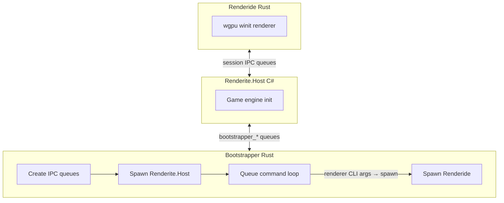

A modern Rust + wgpu renderer for Resonite.

## Status

Experimental: Performance, stability, and platform support are still evolving.  
Visual bugs and missing features are expected. Not intended for general use yet.

## Quick Start

```bash
# 1. Clone the repo
git clone https://github.com/DoubleStyx/Renderide.git
cd Renderide

# 2. Build
cargo build --release

# 3. Run (from the Renderide/ directory)
cargo run --release -p bootstrapper
```

The bootstrapper will launch the Resonite host and connect Renderide automatically.

Logs appear in the `logs/` folder (see [Debugging](#debugging) for details).

## Configuration

Optional `configuration.ini` can be placed next to the executable or in the working directory.  
See `crates/renderide/src/config.rs` for available keys. For example, `rendering.use_opengl` forces the GLES backend (useful when Vulkan is unavailable), and `rendering.use_dx12` forces the DirectX 12 backend (primarily useful on Windows).

## Prerequisites

### Required
- Rust stable toolchain (via [rustup](https://rustup.rs/))
- A working Resonite installation

### Optional (for contributors)
- [.NET 10 SDK](https://dotnet.microsoft.com/download) (used for generators)
- [Slang compiler](https://shader-slang.com/) (used by UnityShaderConverter)

## Architecture



## Repository Layout

### Rust Crates

| Crate          | Path                              | Purpose |
|----------------|-----------------------------------|---------|
| `bootstrapper` | `crates/bootstrapper/`            | Launches Resonite host and manages IPC |
| `renderide`    | `crates/renderide/`               | Main renderer (wgpu, shaders, scene) |
| `interprocess` | `crates/interprocess/`            | Shared-memory IPC queues |
| `logger`       | `crates/logger/`                  | Shared structured logging |

### .NET Projects

| Project               | Path                               | Purpose |
|-----------------------|------------------------------------|---------|
| `UnityShaderConverter` | `generators/UnityShaderConverter/` | Converts Unity `.shader` files → WGSL + Rust modules |
| `SharedTypeGenerator` | `generators/SharedTypeGenerator/`  | Generates Rust types from `Renderite.Shared.dll` |

### Third-Party

| Project                 | Path                                 | Purpose |
|-------------------------|--------------------------------------|---------|
| `UnityShaderParser`     | `third_party/UnityShaderParser/`     | Vendored parser for ShaderLab |
| `Resonite.UnityShaders` | `third_party/Resonite.UnityShaders/` | Vendored Unity shaders |

## Development

### UnityShaderConverter
Converts Unity shaders into WGSL + Rust modules under `crates/renderide/src/shaders/generated/`.

```bash
dotnet run --project generators/UnityShaderConverter -- --help
```

### SharedTypeGenerator
Generates `crates/renderide/src/shared/shared.rs` from Resonite’s shared types.

```bash
dotnet run --project generators/SharedTypeGenerator -- -i path/to/Renderite.Shared.dll
```

### Testing
```bash
cargo test
dotnet test generators/SharedTypeGenerator.Tests/
dotnet test generators/UnityShaderConverter.Tests/
```

## Debugging

All logs go to the `logs/` folder relative to the bootstrapper’s working directory.

| Log file                   | Created by           | Notes |
|----------------------------|----------------------|-------|
| `Bootstrapper.log`         | Bootstrapper         | Orchestration & IPC |
| `HostOutput.log`           | Bootstrapper         | Resonite host stdout/stderr |
| `Renderide.log`            | Renderide            | Main renderer logs |
| `UnityShaderConverter.log` | UnityShaderConverter | Shader conversion details |
| `SharedTypeGenerator.log`  | SharedTypeGenerator  | Type generation details |

**Verbosity**:  
`cargo run --release -p bootstrapper -- --log-level debug`

**GPU Validation**: Set `RENDERIDE_GPU_VALIDATION=1` before starting (performance-heavy).

## Goals

- Full Unity renderer parity
- Modern clustered-forward rendering
- Raytracing and other optional rendering features
- Excellent VR performance and correctness

## License

See [LICENSE](LICENSE).
